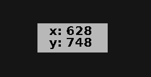

# XPos

A handy X11 tool for showing the mouse position next to it's pointer. xpos is written in plain C.



# How to run

```bash
gcc xpos.c -lX11 -lXi -g -o xpos && ./xpos
```

# License
This code is licensed under GPL-3.0 or newer. For more info see [LICENSE](LICENSE)